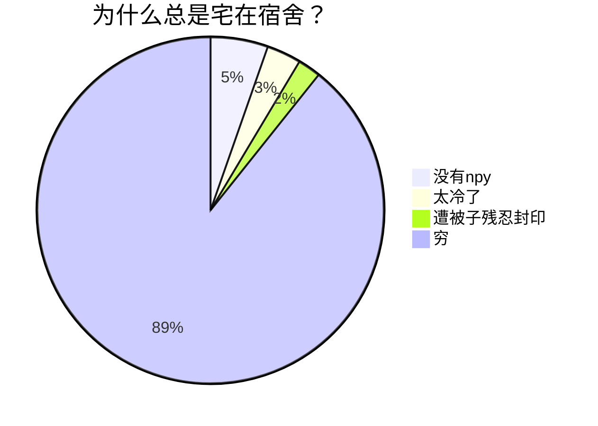

# 前言

## 何为 Markdown？

  Markdown(MD) 是一种轻量级的标记语言( markup language )。什么是标记语言？就是通过一些 标记 ，让你的文章具有一定的格式。让你专注于写字，而不是纠结于各种格式，它和 txt 文件都是纯文本格式，只要有一个文本编辑器。

##  Markdown 编辑器

 MD 只是给文字做标签，所以要写 MD 建议使用合适的编辑器。这里首推国产的 Typora 。理由如下：

- 成熟。 Typora 已经存在六七年了，发展很快，支持很多功能。截至目前为止，除了不能插入文献以外，我找不到它的任何缺点。
- 可定制化。现在很多的 MD 编辑器也在往这方面发展， Typora 自然不例外。我不确定它是不是第一个把浏览器搬到笔记里的产品，但是它确实是我认识的第一个在笔记软件里可以使用浏览器功能的产品。
- 完美支持 MD 。甚至拓展 MD 。 MD 为了简便被设计得非常简单，有时也因此存在其不足。对此很多平台都对 MD 进行了拓展， Typora 也不例外。
- 所见即所得。 Typora 可以通过 MD 的标记，轻轻松松渲染文本。让你的文章看起来更加舒服。
- 配合 Pandoc 可导成各种格式。 Pandoc 是一个简单的文件格式转换器，支持几十种格式转换，特别是 MD 。我们的文章写完之后可以借助它导出成各种格式。

下面是 Typora 中文网站[^1]的 GIF 动图，这个网站和 Typora 一样简洁大方。可以通过文章给出的网址下载 Typora 。虽然现在的稳定版已经开始收费了，但是作者很良心，仍然提供beta版免费下载。


 MD 的文件扩展名是"md"，你想写 MD 时只需把拓展名改成"md"即可。废话不多说，我们先来看  Markdown 的语法。


---

#  Markdown语法入门

## 标题

 Word 通常支持1~6级标题， MD 也一样。 MD 的标题使用`#`作为标记。例如：

``` Markdown
# 一级标题
## 二级标题
### 三级标题
```

### 动图演示

 MD 支持最高六级标题。在 Typora 中，标题的级数可以通过快捷键记忆：`ctrl+数字`，数字从 0 到 6 ，0 是正文，1~6 是标题。下面是演示：


如果只是单纯想要输入`#`怎么办？很简单，你只需要把`#`输入到反引号("\`")之间即可,如下：

```c++
`#`
```

我使用暗主题，所以 GIF 才是黑色的， Typora 内置几种主题都非常好看：


----------------------

##  加粗 

加粗很简单，文字左右各放一个`**`即可：

```c++
**加粗**
```

### 效果如下

**加粗**

快捷键是 `ctrl+b`。

----

## *斜体*

斜体和加粗很相似，只需文字左右各放一个`*`即可：

```c++
*斜体*
```

### 效果如下

*斜体*

快捷键是`ctrl+i `(斜体是 italic)，所以快捷键是`i`)

### 动图演示


---

 *斜体* **加粗**叠加使用即可:

``` Markdown
***斜体加粗***
```

快捷键也叠加：`ctrl+i+b`

---

## ~~删除线~~

删除线，把文字左右各放一个`~~`即可。如下:

```c++
~~删除线~~
```

### 效果

~~删除线~~

快捷键比较奇葩：`atl+shift+5`

### 动图演示


---

## <u>下划线</u>

下划线建议使用快捷键`ctrl+u`，因为下划线 MD 不支持，但是 Typora 有这个快捷键，使用 HTML 渲染。当然，你也可以使用这个标签`<u></u>`手动输入。

---

## 超链接

超链接使用这样的语法:

``` Markdown
[文字](链接)
```

方框中是你的文字，括号里边是你的链接。快捷键是 `ctrl+k`

### 动图演示
 

---

## 添加图片

对的没错！ MD 虽然是纯文本文件，但是人家可以添加图片！方法类似添加链接：

``` Markdown
添加图片

```

就是在添加链接的前面添加一个感叹号而已。快捷键是 `ctrl+shift+i`

效果就不用展示了，我的文章就是 MD 写的，里边的图片自然就是这样添加的。手打地址或者链接肯定麻烦，所以 Typora 可以直接拖拽添加，配合图床使用简直不要太舒服！！

### 动图演示

找张温馨一点的图：


这个方式还可以添加 GIF、视频等。

---

## 分割线

分割线就跟简单了，就像上面这条分割线就是 MD 的标记，单个短杆`-`：

``` Markdown
---
```

### 动图演示


---

## 列表

列表很好玩，也很简单。

### 无序列表

无序列表使用`-`加上一个空格，如下:

``` Markdown
- 第一个
	- 二级无序列表
- 第二个
- 第三个
```

#### 效果如下

无序列表

- 第一个
  - 二级无序列表
- 第二个
- 第三个

快捷键: `ctrl+shift+]`。

### 有序列表

有序列表只需要使用阿拉伯数字加上一个小点(dot)和一个空格:

``` Markdown
1. 一级列表
	1. 二级列表
2. 一级列表
3. 一级列表
```

#### 效果如下

有序列表

1. 一级列表
   1. 一级列表
2. 一级列表
3. 一级列表

快捷键：`ctrl+shift+[`。

### 动图演示


## 任务列表

任务列表很简单，就是`-空格[空格]空格文字`表示 未完成 ，`-空格[x]空格文字`表示 完成 。

``` Markdown
未完成
- [] 明天好好复习

完成
- [x] 待会好好吃饭
```

### 效果如下

- [ ] 明天好好复习
- [x] 待会好好吃饭

### 动图演示


可以看到， Typora 是有交互功能的，任务列表可以点击，就像表格一样。

---

## 引用

当你想引用别人的一句名言时，就可使用引用了。引用的格式也比较简单：一个尖括号加空格，然后就是名言—— `> 名言`

```c++
> 子曰：君子不器。
```

### 效果如下

> 子曰：君子不器。

快捷键：要个啥快捷键？？

### 动图演示

### 

---

## 表格

表格比较重要了。 MD 标准的没有表格，但是拓展的 MD 是有的。格式比较神奇：

``` Markdown
|姓名|身份|排行|
|:---|:---:|---:|
|左对齐|中间对齐|右对齐|
|刘备|皇叔|老大|
|关羽|商户|老二|
|张飞|屠户|老三|
```

`|---|---|---|`以上是表头 ，以下是表身 ，冒号`:`表示对齐方式(下面没有展示出来，下面都是居中对齐)。

### 效果如下

| 姓名 | 身份 | 排行 |
| :--: | :--: | :--: |
| 刘备 | 皇叔 | 老大 |
| 关羽 | 商户 | 老二 |
| 张飞 | 屠户 | 老三 |

快捷键是 `ctrl+t`。谁都不会亲手去打这个表格，所以直接使用快捷键。

### 动图演示


 Typora 里边处理表格很舒服，此外还可以通过自定义的 CSS 改变表格格式：


## 注脚

格式是`[^ 数字]`。

```lua
鲁迅说：我没说过[^4]。


---------------
假设这里是篇末
---------------
[^4]: 《狂人日记》，p250.
```

### 效果如下

鲁迅说：我没说过[^4]。

[^4]: 《狂人日记》，p250.

### 动图演示


---

我知道大家觉得这个很无聊，毕竟码字谁都会，但是我下面介绍的东西，理科生和文科生就该提起精神了，因为这会挑战你们做笔记的速度。

## 画图——文科生

首先声明， MD 不支持绘图，但是现在我们使用的是 Typora ，它集成了 MD 里绘图的语言： Mermaid 。是的，美人鱼。在 MD 里使用某种(编程)语言的时候，都要放到一对\`\`\`里边，如下：

使用python
\`\`\`python
import nothing

print(nothing)
\`\`\`

使用C++
\`\`\`cpp
\#include \<iostream\>

int main(int argc, char const* argv[]){
	return 0;
}
\`\`\`

使用lua
\`\`\`lua
local cos = math.cos
local print = print
_ENV = nil
\`\`\`

所以使用 Mermaid 的时候，也需要这样使用

\`\`\`mermaid

\`\`\`

可以使用快捷键 `ctrl+shift+k` 快速插入代码。

### 动图演示


---

 Mermaid 支持的绘图格式很多，包括时序图 、甘特图 、饼图和流程图等。下面主要讲解饼图 、时序图和流程图 。

### 饼图

我们使用 Mermaid 画图，所以先进入 Mermaid :


如果我们要画 饼图 ，我们需要在首行标注饼图（刚考过六级，饼图怎么说？ cookie chart ? 非也： pie ）。

``` markdown
pie
	title 为什么总是宅在宿舍？
	"没有npy": 30
	"太冷了": 12
	"遭被子残忍封印": 5
	"穷": 500
```

#### 效果如下：



#### 动图演示


### 流程图

流程图的画法主要有两种:  Mermaid 中的 Graph 和 Flowchart 。先介绍 Graph 。

#### Graph

主要是方向性。你的流程图如果从左( Left)到右( Right)，那就再首行写下 `graph LR`(反之`graph RL`)，如果是上( Top)到下(Down)就是`graph TD`(反之 `graph BT`,  bottom top)。使用两个短杆加小于号`–>`表示方向。

方向：

- `-->`表示直线
- `-.->`表示虚线
- `--文字-->`表示实线标签
- `-.文字.->`表示虚线标签

方框:

- 纯文字，默认`方框`
- id(文字)，`圆角`。所谓`id`就是给名字找一个方便记忆的id
- id[()]，`圆柱`
- id([])，`椭圆`
- id{}，`菱形`
- 等等

```markdown
graph TD
	夏明-->大东
	夏明-.->大东
	夏明--标签-->大东
	夏明-.标签.->大东
```

#### 效果如下


因为是介绍，所以不会太深入了。

#### Flowchart

 Flowchart 和 Graph 差不多，但是更加丝滑：

```markdown
flowchart TD
	%% subgraph 是子图
	subgraph Left
	男主-->铃兰一中
	end
	
	subgraph Right
	女主-->快乐星球
	end
   
	女主 --x 铃兰一中
	男主 --x 快乐星球
	
	Left-->南开大学
	Right-->南开大学
```

#### 效果如下


#### 插个时序图

```markdown
sequenceDiagram
	participant Alice
	participant Bob
	participant Hohn
	Alice->>Hohn: Hello Hohn, how are you ?
	loop HealthCheck
		Hohn->>Hohn: Fight against hypochondria
    end
    Note right of Hohn: Rational thoughts <br/>prevail
    Hohn-->>Alice:Greate!
    Hohn->>Bob: How about you?
    Bob-->>Hohn: Jolly good
```


## 公式——理科生

写数学公式是物理数学同学不可避免地悲剧，使用 Word 记录的话直接就是死亡，所以很多人使用手写(电子笔记)。但是我想说， MD 可以救你。

公式使用 $L_EX$ 渲染，所以还是很好玩地。行内公式左右各一个 `$` ，独立公式则用两个 `$$` 。如下：

``` Markdown
$$ 
\sum^{x \to \infty}_{y \to 0}{\frac{x}{y}} 
$$

$ \alpha $
```

#### 效果如下

$$
\sum^{x \to \infty}_{y \to 0}{\frac{x}{y}}
$$

$ \alpha $

不过我使用的不多，大家要是感兴趣地话可以去查查，随便百度就可以找到很多教程的。我这里浅尝辄止。

## 上下标和高亮

上下标和高亮是 Typora 支持的，其他编辑器未必支持。

```markdown
上标 X^2^
下标 O~2~
高亮 ==中国==
```

### 效果如下

上标 $X^2$

下标 $O_2$

高亮 <mark>中国</mark>

需要在 Typora 中打开：


---

#  Markdown回顾

## 定义

  Markdown 是一门轻量级的标记语言，可以通过几个简单的标记让你的文章具有一定的格式。Markdown 写出来的文章和笔记本质上只是纯文本，通过笔记软件或者一些网站渲染，可以展现不同的效果，可以让你专心于写作而不担心排版问题。

## 渲染

网络平台或者软件、网址进行渲染。

目前大多数的笔记平台(有道等)、博客平台(知乎、博客园等)、思维导图(Xmind、百度脑图等)都支持  Markdown ，除了被诟病的 wx 公众号。公众号不支持  Markdown ，但是仍然有很多人开发了很多地接入公众号的工具，基本都是网页工具，可以实现软件写完之后复制到公众号即可——例如我就是这样，本地写完，导出 HTML 文件，复制到公众号即可。

## 语法和Typora快捷键

1. 标题

   使用井号`#空格标题`，几个井号就是几级标题。快捷键:`ctrl+数字(0-6)`。

   例如：`# 一级标题`、`## 二级标题`

2. 加粗

   文字左右各放一个`**`。快捷键是`ctrl+b`。

   例如：`**我是249+1**`

3. 斜体

   文字左右各放一个`*`。快捷键`ctrl+i`。

   例如：`*学名需要斜体，因为人家是拉丁文*`

4. 删除线

   文字左右各放一个`~~`。快捷键是`alt+shift+5`。

   例如：`~~我是大聪明~~`

5. 下划线

   文字放到`<u></u>`标签里边。快捷键`ctrl+u`。

   例如：`<u>这道题要考</u>`

6. 超链接和图片

   方括号`[]`里边放文字或者图注，紧接着括号`()`里边放网址或者图片地址。快捷键：超链接`ctrl+k`;图片`ctrl+shift+i`。实在懒，直接拖拽。

   例如：`[7k7k](www.7k7k.com)`、`[图片](D:/user/pictures/atl.jpg)`

7. 分割线

   三个短杆`-`即可，没有快捷键。

   例如: `---`

8. 列表

    有序列表 使用阿拉伯数字加点(dot)加空格(space)加文字。快捷键`ctrl+shift+[`

    无序列表 使用短杆`-`加空格(space)加文字。快捷键`ctrl+shift+]`

   例如：`1. 第一项`、`- 列举`

9. 任务列表

    已完成 使用短杆`-`加空格(space)加方括号包围的x`[x]`加空格(space)加文字。

    未完成 使用短杆`-`加空格(space)加方括号包围的空格(space)`[ ]`加空格加文字。

   例如：`- [ ] 未完成 `、`- [x] 完成了`

10. 引用

    使用右尖括号`>`加空格(space)加文字。

    例如：`> 子曰: 吾知子知吾不知子知吾知。`

11. 表格

    短杆和竖杠排列，这个，建议直接使用快捷键`ctrl+t`。

12. 注脚

    方括号`[]`里边放`^`和数字。

    例如：

    ```makefile
    [^1]
    ```

13. 画图和公式

    画图放到代码编辑块里边。快捷键：`ctrl+shift+k`，选择`mermaid`。

    公式左右各放一个 `$` 或者 `$$` ，前者是行内公式，后者是块公式。

    例如：
```bash
$ x^2 $
    
$$ 
sum^{x \to 100}_{x=0} 
$$
```

14. 上下标和高亮

    这是 Typora 的拓展，上边使用`^`包围，下标使用`~`包围，高亮使用`==`包围。

    例如：`X^2^`、`O~2~`、`==收到==`

---


# Typora

 Typora [^1]官网可以下载 Beta 版，免费使用。作为一款优秀的  Markdown 笔记软件，无可挑剔，但是需要配合 Pandoc (导出任何格式，导出 PDF 需配合 $L_EX$ )使用。建议先安装 Pandoc 再安装 Typora 。

 Typora 包含几个主题，有需要的也可以上网查找相关主题，甚至自己设置自己的主题——它支持 CSS 格式，只要自己会写就行。

## 安装

简单安装即可，确认到底。


## Pandoc

 Pandoc [^2] 官网下载。如果电脑上不去，可以使用手机。


## 设置 Pandoc 路径


## 如果需要导出成PDF

如果要导出成 PDF ，建议安装$MiKT_EX$[^3]。安装有任何问题可以上网查找问题。

---

# 导出效果

下面可以看看我的导出结果。因为我的这篇文章也是使用 Typora 写的，所以恰好可以看看。


## 导出 PDF


## 导出 Word 文档


## 导出到公众号


至于 MD 效果如何，想必大家看完我的文章就知道了。

# 相关网址

[^1]: https://www.typora.io
[^2]: https://pandoc.org
[^3]: https://miktex.org
